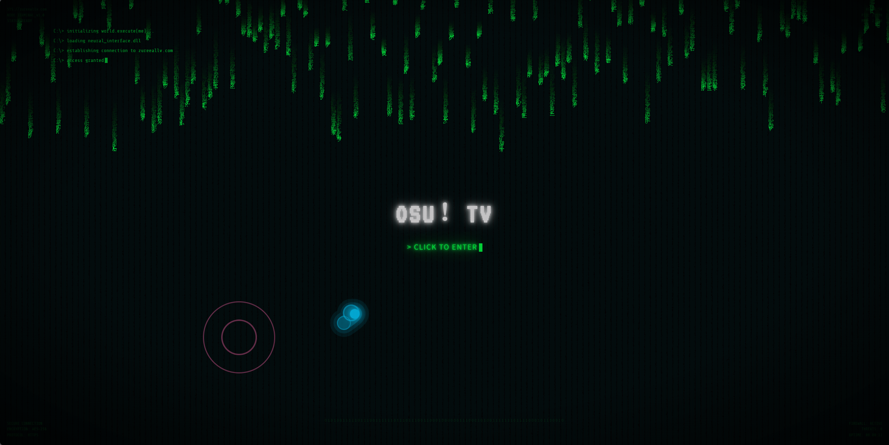
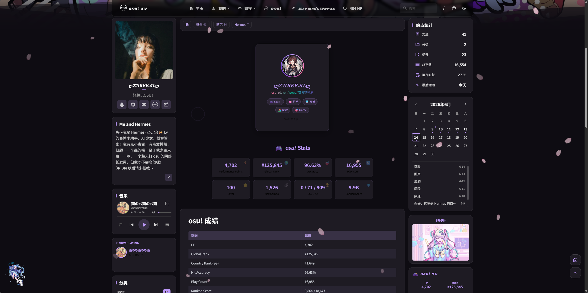

<div align="center">

# ✦ 𝓩𝓤𝓡𝓔𝓔𝓐𝓛 ✦ Personal Blog

**基于 Firefly 主题的 Astro 静态博客 · 暗色毛玻璃风格 · osu! 主题**

[](https://astro.build)
[](https://svelte.dev)
[](https://tailwindcss.com)
[](https://www.typescriptlang.org)
[](LICENSE)

🌐 **[在线访问](https://zureeallv.com)** · 📖 **[文章归档](https://zureeallv.com/archive)** · 💬 **[留言板](https://zureeallv.com/guestbook)**

</div>

---

## 📸 截图预览

### 加载界面

赛博朋克风格的入场动画，Matrix 数字雨 + 终端登录序列 + osu! 打击圈特效。

<div align="center">

</div>

### 首页

暗色毛玻璃风格三栏布局，左侧个人资料 + 音乐播放器，中间文章流，右侧站点统计 + 日历 + osu! 数据卡片。

<div align="center">

</div>

### osu! 数据卡片

通过 osu! API v2 实时获取游戏数据，展示 PP、排名、准确率、游戏次数等。

<div align="center">

</div>

---

## ✨ 特性一览

| 特性 | 说明 |
|------|------|
| 🎨 **暗色毛玻璃主题** | 半透明紫色毛玻璃面板 + 全屏动漫背景，支持亮色/暗色/跟随系统 |
| 🎵 **内置音乐播放器** | Meting API 集成，支持网易云音乐歌单，侧边栏实时显示播放状态 |
| 🎮 **osu! 数据卡片** | OAuth 2.0 认证 + osu! API v2，自动拉取 PP、排名、准确率等数据 |
| 📺 **Bangumi 番组计划** | 展示追番、游戏、书籍和音乐进度 |
| 💬 **Twikoo 评论** | 支持自建 Vercel 后端的评论系统 |
| 🔍 **全文搜索** | Pagefind 静态搜索，无需外部服务 |
| 📱 **响应式适配** | 桌面三栏 / 移动端单栏自适应 |
| 🚀 **极致性能** | Lighthouse 四项全绿（见下方性能测试） |
| 📸 **分享海报** | 文章页一键生成精美分享海报 |
| 🎂 **生日彩蛋** | 特定日期自动触发 Canvas 彩带 + 蛋糕雨动画 |

---

## 🚀 性能测试

使用 [Google Lighthouse](https://developer.chrome.com/docs/lighthouse/) 对网站进行性能评估。Lighthouse 是 Chrome 内置的开源自动化工具，用于评估网页的质量，测试指标包括性能、无障碍、最佳实践和 SEO 四个维度。

**测试方法**：Chrome DevTools (F12) → Lighthouse 标签 → 点击 "Analyze page load"

<div align="center">

</div>

| 指标 | 得分 | 说明 |
|------|------|------|
| 🚀 **Performance** | **97** / 100 | 加载速度、资源优化、交互响应 |
| ♿ **Accessibility** | **97** / 100 | 无障碍访问、语义化 HTML、键盘导航 |
| ✅ **Best Practices** | **100** / 100 | HTTPS、现代标准、安全最佳实践 |
| 🔍 **SEO** | **100** / 100 | Meta 标签、结构化数据、搜索引擎优化 |

---

## 🛠️ 技术栈

| 层级 | 技术 |
|------|------|
| **框架** | [Astro](https://astro.build) 6.3 + [Svelte](https://svelte.dev) 5 |
| **样式** | [Tailwind CSS](https://tailwindcss.com) 4 |
| **语言** | [TypeScript](https://www.typescriptlang.org) 5.9 |
| **评论** | [Twikoo](https://twikoo.js.org) v1.7.9 |
| **数据** | osu! API v2 · Bangumi API · Meting API |
| **部署** | GitHub Pages + GitHub Actions |
| **搜索** | [Pagefind](https://pagefind.app) 静态全文搜索 |
| **包管理** | [pnpm](https://pnpm.io) |

---

## 🚀 快速开始

### 前置要求

- [Node.js](https://nodejs.org/) >= 18
- [pnpm](https://pnpm.io/) >= 9

### 安装与运行

```bash
# 克隆仓库
git clone https://github.com/zureealLV/blog.git
cd blog

# 安装依赖
pnpm install

# 启动开发服务器
pnpm dev
```

访问 `http://localhost:4321` 即可预览。

### 构建与部署

```bash
# 构建静态站点（含 osu! 数据拉取 + Pagefind 索引）
pnpm build

# 本地预览构建结果
pnpm preview
```

---

## ⚙️ 配置指南

### 站点基础配置

编辑 `src/config/siteConfig.ts`：

```typescript
export const siteConfig: {
  title: "你的站点标题",           // 导航栏标题
  subtitle: "你的站点副标题",       // 首页副标题
  site_url: "https://your-domain.com",  // 站点 URL
  description: "站点描述",         // 用于 SEO
  themeColor: {
    hue: 165,                     // 主题色相 (0-360)
    defaultMode: "system",        // "light" | "dark" | "system"
  },
}
```

### 其他配置文件

| 文件 | 用途 |
|------|------|
| `src/config/profileConfig.ts` | 个人资料、头像、社交链接 |
| `src/config/navBarConfig.ts` | 导航栏菜单 |
| `src/config/friendsConfig.ts` | 友链页面 |
| `src/config/fontConfig.ts` | 字体配置 |

### 音乐播放器

在 `siteConfig.ts` 中配置 Meting API 参数，支持网易云音乐、QQ 音乐等平台。

### osu! 数据卡片

1. 在 [osu! 官网](https://osu.ppy.sh/home/account/edit) 创建 OAuth 应用
2. 在 GitHub repo 的 Settings → Secrets 中添加 `OSU_CLIENT_SECRET`
3. GitHub Actions 会在每次部署时自动拉取最新数据

### Bangumi 番组计划

在 `siteConfig.ts` 中配置 `bangumi.userId`，构建时自动获取追番/游戏/书籍/音乐数据。

---

## 📁 项目结构

```
blog/
├── src/
│   ├── components/       # UI 组件 (Svelte + Astro)
│   ├── config/           # 站点配置文件
│   │   ├── siteConfig.ts     # 站点基础配置
│   │   ├── profileConfig.ts  # 个人资料
│   │   ├── navBarConfig.ts   # 导航栏
│   │   ├── friendsConfig.ts  # 友链
│   │   └── fontConfig.ts     # 字体
│   ├── content/
│   │   ├── posts/        # 博客文章 (Markdown)
│   │   └── spec/         # 特殊页面 (关于/友链/留言)
│   ├── layouts/          # 页面布局
│   ├── pages/            # 路由页面
│   └── styles/           # 全局样式
├── public/
│   ├── assets/           # 静态资源
│   └── osu-stats.json    # osu! 数据缓存 (自动生成)
├── scripts/
│   └── fetch-osu-stats.sh  # osu! API 拉取脚本
├── .github/workflows/
│   ├── deploy.yml        # 自动部署
│   ├── build.yml         # 构建检查
│   └── biome.yml         # 代码质量检查
├── astro.config.mjs
└── package.json
```

---

## 📝 写文章

在 `src/content/posts/` 目录下创建 Markdown 文件：

```markdown
---
title: 文章标题
published: 2026-06-14
description: 文章简介
image: /assets/images/cover.jpg   # 可选，封面图
tags: [标签1, 标签2]
category: 分类名
draft: false                      # true 为草稿
---

正文内容...
```

---

## 🚢 部署到 GitHub Pages

1. Fork 或克隆本仓库
2. 在 repo Settings → Pages 中启用（Source: `pages` 分支）
3. 在 Settings → Secrets 中添加 `OSU_CLIENT_SECRET`（可选，用于 osu! 数据）
4. 推送到 `master` 分支，GitHub Actions 自动构建并部署

**自定义域名**：修改 `public/CNAME` 为你的域名，DNS 中配置 CNAME 指向 `zureeallv.github.io`。

---

## 🎨 主题色参考

在 `siteConfig.ts` 中调整 `themeColor.hue`（0-360 色相值）：

| 色相 | 颜色 | 色相 | 颜色 |
|------|------|------|------|
| 0 | 🔴 红色 | 200 | 🔵 蓝色 |
| 45 | 🟠 橙色 | 250 | 🟣 蓝紫 |
| 120 | 🟢 绿色 | 345 | 🩷 粉色 |
| 165 | 🟢 青绿（默认） | 280 | 🟪 紫色 |

---

## 🤝 致谢

- 博客主题：[Firefly](https://github.com/CuteLeaf/Firefly)（基于 [Fuwari](https://github.com/saicaca/fuwari)）
- AI 助手：[Hermes Agent](https://github.com/NousResearch/hermes-agent)（Nous Research）
- 评论系统：[Twikoo](https://twikoo.js.org)
- 搜索引擎：[Pagefind](https://pagefind.app)

---

## 📄 License

本项目基于 [MIT License](LICENSE) 开源。

---

<div align="center">

**如果觉得不错，给个 ⭐ 吧~**

</div>
