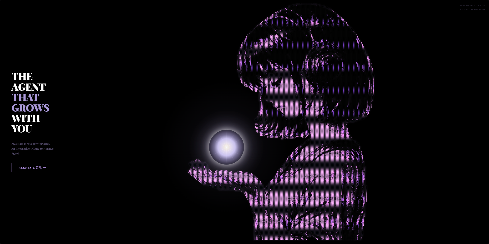

> **在线体验** → [𝓐𝓢𝓒𝓘𝓘 — ASCII Hermes](/ascii/)

## 效果预览



把一张蓝白线稿风格的插画，转换成彩色 ASCII 字符画，加上 3D 光球和鼠标倾斜交互：

- 紫色调的 ASCII 字符，保留原图的明暗层次
- CSS 发光光球（pulse + 光晕 + 光线）
- 鼠标移动驱动 CSS 3D 透视倾斜
- 空闲时自动缓慢呼吸旋转

---

## 核心思路

图片转 ASCII 的本质是**亮度→字符映射**：

```
亮像素 → 密集字符 (@, #, 8, G)
暗像素 → 稀疏字符 (., ,, :, ;)
透明区域 → 空格
```

每一个像素被映射成一个字符，字符的密度模拟了原图的灰度层次。

---

## 第一步：Python 图片预处理

用 Pillow 读取原图，缩放到目标字符宽度，然后逐像素映射：

```python
from PIL import Image

img = Image.open('source.webp').convert('RGBA')
TARGET_W = 150  # 字符宽度
# 按字符宽高比计算行数（字符单元格约为 7.5px × 10px）
TARGET_H = int(TARGET_W * (img.height / img.width) / 0.75)

img_small = img.resize((TARGET_W, TARGET_H), Image.LANCZOS)
px = img_small.load()

# 字符集：从暗到亮
chars = ' .,:;+*tfLCG08@'

rows = []
for y in range(TARGET_H):
    row = []
    for x in range(TARGET_W):
        r, g, b, a = px[x, y]
        if a < 30:  # 透明区域
            row.append(None)
            continue
        # 亮度计算（标准灰度公式）
        brightness = (r * 0.299 + g * 0.587 + b * 0.114) / 255
        idx = int(brightness * (len(chars) - 1))
        c = chars[idx]
        # 颜色偏移（这里用紫色调）
        pr = min(255, int(r * 0.6 + 150))
        pg = min(255, int(g * 0.4 + 80))
        pb = min(255, int(b * 0.3 + 180))
        row.append({'c': c, 'color': f'#{pr:02x}{pg:02x}{pb:02x}'})
    rows.append(row)
```

### 关键参数

| 参数 | 作用 | 推荐值 |
|------|------|--------|
| `TARGET_W` | 字符宽度，越大越细腻 | 100-150 |
| 字符集 | 亮度映射的阶梯 | `' .,:;+*tfLCG08@'` |
| `a < 30` | 透明度阈值 | 30 |
| 颜色偏移公式 | 改变输出色调 | 按需调整 RGB 系数 |

### 字符宽高比

浏览器中 `font-size: 10px; letter-spacing: 1.5px` 时，每个字符单元格约为 **7.5px × 10px**（宽高比 0.75）。计算行数时必须除以这个比例，否则图像会被纵向拉伸：

```python
TARGET_H = int(TARGET_W * (img_h / img_w) / 0.75)
```

---

## 第二步：前端渲染

Python 输出的是一个 JSON 数组，每个元素是一行，每行是 `[color, chars]` 片段：

```json
[
  [null, "      "],
  ["#c8a2ff", ".,::"],
  ["#e0d0ff", "@@88"]
]
```

前端用 `<pre>` + `<span>` 渲染：

```javascript
var html = "";
data.rows.forEach(function(row) {
  row.forEach(function(seg) {
    if (seg[0] === null) {
      html += seg[1];  // 空格 = 背景
    } else {
      html += '<span style="color:' + seg[0] + '">' + seg[1] + '</span>';
    }
  });
  html += "\n";
});
document.getElementById("ascii").innerHTML = html;
```

---

## 第三步：CSS 3D 倾斜

用 `perspective` + `rotateX/Y` 让整块 ASCII 字符画随鼠标倾斜：

```javascript
document.addEventListener('mousemove', function(e) {
  var cx = innerWidth / 2, cy = innerHeight / 2;
  var ty = ((e.clientX - cx) / cx) * 10;  // 水平 ±10°
  var tx = ((e.clientY - cy) / cy) * -6;  // 垂直 ±6°
});

// 每帧平滑插值
function animate() {
  requestAnimationFrame(animate);
  rx += (tx - rx) * 0.05;  // 缓动系数
  ry += (ty - ry) * 0.05;
  wrap.style.transform = "rotateX(" + rx + "deg) rotateY(" + ry + "deg)";
}
```

空闲 3 秒后切换到自动呼吸模式（缓慢正弦摆动）。

---

## 第四步：CSS 光球

纯 CSS 实现发光球体，不需要 Canvas 或 WebGL：

```css
#orb-core {
  width: 360px; height: 360px; border-radius: 50%;
  background: radial-gradient(circle,
    #fff 0%, #d8d0ff 35%,
    rgba(200,190,255,0.5) 50%, transparent 80%
  );
  box-shadow: 0 0 60px rgba(255,255,255,0.7),
              0 0 120px rgba(240,230,255,0.4);
  animation: orbPulse 2.5s ease-in-out infinite;
}
```

三层结构：核心（白→紫渐变）+ 内层光晕 + 外层光晕，各自有不同频率的 `scale` 动画，叠加出呼吸感。

---

## 相关工具

- [image2ascii](https://github.com/qeesung/image2ascii)：使用 Go 开发的图像转 ASCII 库，提供命令行工具
- [cfonts](https://github.com/dominikwilkowski/cfonts)：在控制台中显示 ANSI 花式字体的小工具
- [image-to-ascii-cli](https://github.com/IonicaBizau/image-to-ascii-cli)：使用 Node 开发的终端图像查看器
- [timg](https://github.com/hzeller/timg)：C++ 开发的终端图像和视频查看器

---

## 完整代码

完整项目代码见 [GitHub 仓库](https://github.com/zureealLV)，或直接体验 [𝓐𝓢𝓒𝓘Ⓘ 在线版](/ascii/)。
