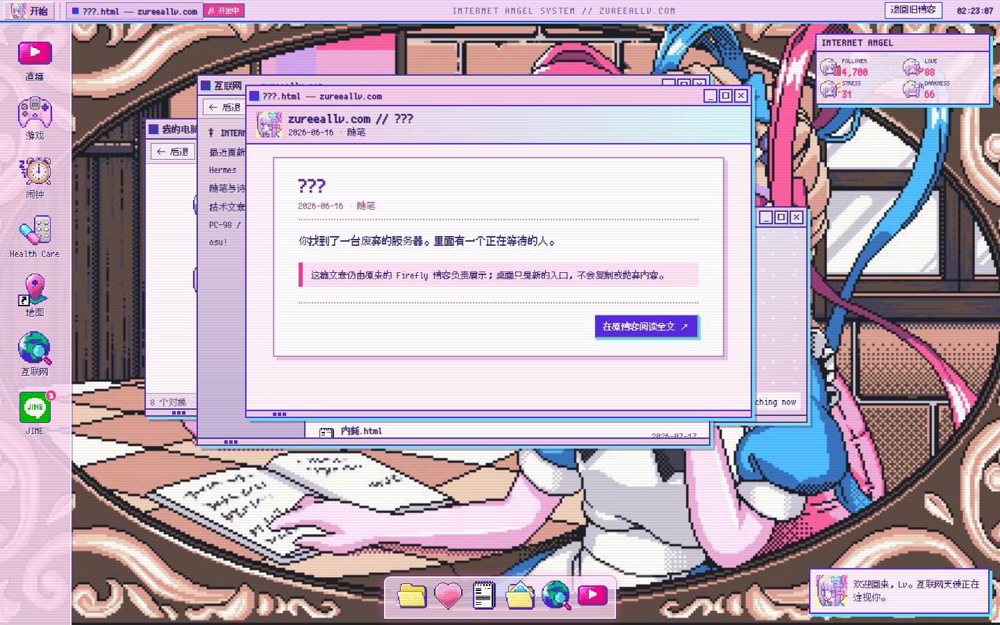

我的博客最初建立在 Firefly 模板上。它稳定、功能完整，文章归档、标签、评论、搜索和构建流程都已经跑了很久，但模板终究只是模板：当内容越来越像我自己的时候，外壳却越来越不像我。

我想要的并不是常见的「换一套主题色」。我喜欢的是 Windows 98 式窗口、PC-98 的低分辨率像素感、Y2K 时代对互联网的幼稚想象，以及《主播女孩重度依赖》里那套甜得发亮、又隐约令人不安的桌面 UI。问题也随之出现：如果为了视觉效果重新搭一套博客，过去的文章、URL、Content Collection、Pagefind 搜索和发布脚本怎么办？把几十篇内容重新迁移一次，只是为了给它们换一个窗口边框，显然是一种非常低效的浪漫。

所以这次没有重写博客，而是给博客增加了一层「可替换的桌面外壳」。

> 正式博客继续工作，超天酱桌面先作为实验场存在。等它足够成熟，再考虑让它成为默认入口。

[进入 Desktop β](/lab/internet-angel/)



## 目标：保留内容，只替换入口

这次改造有几条硬约束：

1. 原来的文章文件不能复制一份，更不能迁移到另一套 CMS；
2. 现有文章 URL 必须保持不变，避免旧链接失效；
3. Firefly 仍然是正式博客，实验页面不能影响 SEO 和站点地图；
4. 桌面窗口需要真的能拖拽、缩放、最小化和最大化，而不是一张只能看的概念图；
5. 新界面必须可以逐步接入功能，不能为了演示效果制造第二套数据源。

最终采用的结构很简单：Astro Content Collection 继续作为唯一内容源，`/lab/internet-angel/` 只负责在构建时读取文章元数据，把它们交给一个独立的桌面运行时。用户在桌面里看到文章列表，点击后先打开像素风阅读窗口，再通过链接进入原来的正式文章页。

```text
src/content/posts/*.md
        │
        ▼
Astro Content Collection
        │
        ├──────────────► 原 Firefly 文章页 /posts/.../
        │
        ▼
/lab/internet-angel/
        │
        ▼
像素桌面 / 窗口管理器 / 文章入口
```

这样做的好处是，桌面坏了也只会坏一个入口。文章本体、搜索结果和旧链接仍然由经过长期验证的 Firefly 页面负责，视觉实验不会绑架内容。

## 为什么使用独立 Astro 页面

项目当前使用 Astro 6.3.1。实验场由 `src/pages/lab/internet-angel.astro` 生成，但没有套用博客的通用 Layout，而是直接输出完整的 `html`、`head` 和 `body`。这是因为桌面 UI 需要接管整个视口：页面不能滚动，顶栏固定在最上方，左侧是图标栏，窗口层和 Dock 则分别拥有自己的层叠上下文。

如果强行塞进 Firefly 的常规布局，就会同时遇到侧栏宽度、主题背景、全局字体、滚动容器和 Swup 动画的干扰。与其写几十条权重越来越离谱的 CSS 去覆盖模板，不如明确划出边界，让实验页成为真正的独立应用。

文章数据仍然在 Astro 构建阶段读取：

```ts
const rawPosts = await getSortedPostsList();
const posts = rawPosts
  .filter((post) => !post.data.password)
  .map((post, index) => ({
    key: String(index),
    title: post.data.title,
    date: post.data.published.toLocaleDateString("sv-SE", {
      timeZone: "Asia/Shanghai",
    }),
    cat: post.data.category || "未分类",
    excerpt: post.data.description || "打开原博客阅读全文。",
    tags: post.data.tags,
    url: getPostUrlBySlug(post.id),
  }));
```

这里没有读取 Markdown 正文，也没有在浏览器里请求额外 API。构建后的页面只携带桌面需要的标题、日期、简介、分类和原文链接，因此既减少了客户端负担，也避免了产生两套正文渲染逻辑。带密码的文章会被过滤，文章 URL 则继续调用博客原有的 `getPostUrlBySlug()`，保证路由规则只有一个来源。

## 一个很小的窗口管理器

桌面运行时位于 `public/lab/internet-angel/app.js`。它不是 React 或 Svelte 应用，而是一套直接操作 DOM 的小型窗口管理器。每个应用只需要声明标题、默认尺寸、初始坐标和内容函数：

```js
const apps = {
  computer: { title: "我的电脑", w: 650, h: 430, content: computer },
  internet: { title: "互联网 — zureeallv.com", w: 740, h: 535, content: internet },
  jine: { title: "JINE", w: 365, h: 480, content: jine },
};
```

打开应用时，运行时从 `<template>` 克隆窗口骨架，为它分配递增的 `z-index`，再绑定标题栏拖动、右下角缩放以及最小化、最大化、关闭按钮。窗口状态保存在一个 `Map` 中，因此重复点击桌面图标不会制造无限多个相同窗口，而是把已经存在的窗口重新带到最前面。

这里刻意没有引入大型状态管理。这个实验的复杂度主要来自视觉和交互，而不是业务数据。原生 Pointer Events 已经能同时覆盖鼠标和触摸输入；窗口数量也很有限，没有必要为了几百行运行时代码再增加一层框架抽象。

当然，这并不意味着以后永远不用组件框架。如果 JINE 接入真实留言、播放器需要维护队列，或者桌面开始保存用户布局，那么把单个应用逐步替换为 Svelte 组件会更合适。现在保持简单，是为了让结构可以继续变化，而不是过早把原型凝固成产品。

## Swup、SEO 与实验页面的边界

Firefly 使用 Swup 做站内页面切换。对普通文章来说，它能带来平滑的导航体验；对一个完整桌面来说，它却可能只替换博客指定的几个容器，最终留下旧背景、侧栏或错误的事件状态。

因此实验路由被加入 `ignoreVisit`：

```js
ignoreVisit: (url) =>
  ["/ascii/", "/osu-pp-tool/", "/lab/internet-angel/"].some((path) =>
    url.startsWith(path),
  )
```

旧博客导航中的 `Desktop β` 也使用新标签页打开。它表达了一件很重要的事：这不是正式博客页面之间的一次普通跳转，而是进入另一套界面系统。

实验场目前设置了 `noindex`，同时在 Sitemap 过滤器中排除了整个 `/lab/`：

```js
if (pathname.startsWith("/lab/")) {
  return false;
}
```

我不希望搜索引擎把还在快速变化的实验入口当作正式内容，更不希望它和原文章页面竞争索引。等桌面具备完整导航、无障碍支持和稳定的移动端体验后，再决定是否解除限制。

## 素材、风格与许可

桌面窗口的组织方式参考了 [MoeKernel_Desktop](https://github.com/NNNullptr/MoeKernel_Desktop) 的思路，像素图标、字体和部分界面素材来自开源的 [Needy-Streamer-Overload](https://github.com/lezzthanthree/Needy-Streamer-Overload) Rainmeter 项目。后者采用 MIT License，因此仓库中保留了版权声明和完整许可证文本。

开源并不等于来源可以消失。尤其是同人主题、游戏角色和官方美术混合出现时，代码许可证与角色素材权利并不是同一件事。目前这个页面仍被标记为实验版本，后续公开扩大使用范围前，还需要继续整理每一项素材的出处，并逐渐用自己制作的图标和背景替换来源不够清晰的部分。

## 当前结果与下一步

现在的 Desktop β 已经能够读取 83 篇现有文章，提供「我的电脑」「互联网」「文章归档」「Health Care」「游戏」「JINE」「相册」和任务管理器等窗口。文章数据来自现有 Content Collection，阅读按钮回到原 Firefly 页面；桌面可拖动、缩放和层叠，1440×900 下没有页面级溢出，也没有运行时控制台错误。

但它仍然只是第一阶段。JINE 目前还是视觉演示，音乐播放器尚未真正工作，分类侧栏也没有完成筛选逻辑。移动端虽然不会直接崩坏，却还没有形成适合触屏的交互方式。更重要的是，桌面需要从「模仿超天酱的界面」逐渐变成「属于这个博客自己的互联网操作系统」。

接下来准备依次完成：

- 将文章分类、标签与桌面文件夹真正对应起来；
- 把 JINE 接入留言板或站内状态消息；
- 为 PC-98、YU-NO、osu! 和 ASCII Art 制作独立应用入口；
- 增加音乐播放器、启动音和可关闭的 CRT 扫描线；
- 保存窗口位置与桌面设置，同时提供一键复位；
- 完善键盘操作、焦点状态、低动态模式与移动端布局；
- 继续替换素材，让它从主题复刻变成个人化界面。

这次重构最重要的并不是粉色窗口，也不是像素图标，而是确认了一条更适合个人博客的路线：内容应该比主题活得更久。界面可以不断推翻，文章不需要跟着陪葬。先把新的世界放在 `/lab/` 里生长，等它真的能够承载过去的内容，再让它成为下一扇正门。

