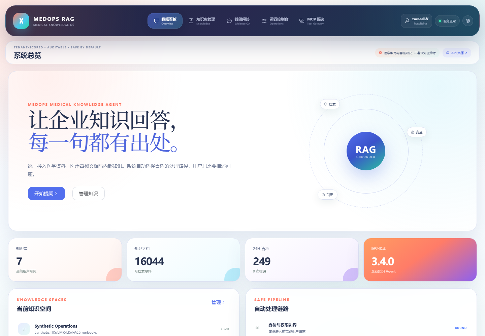
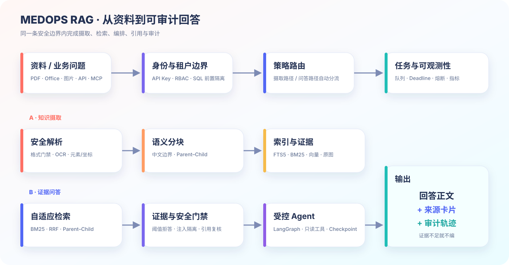
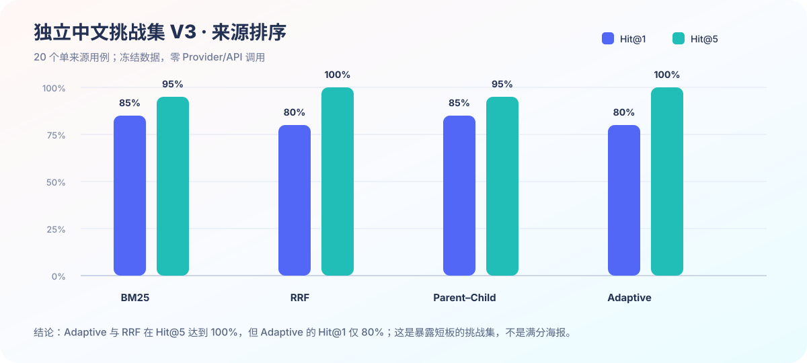
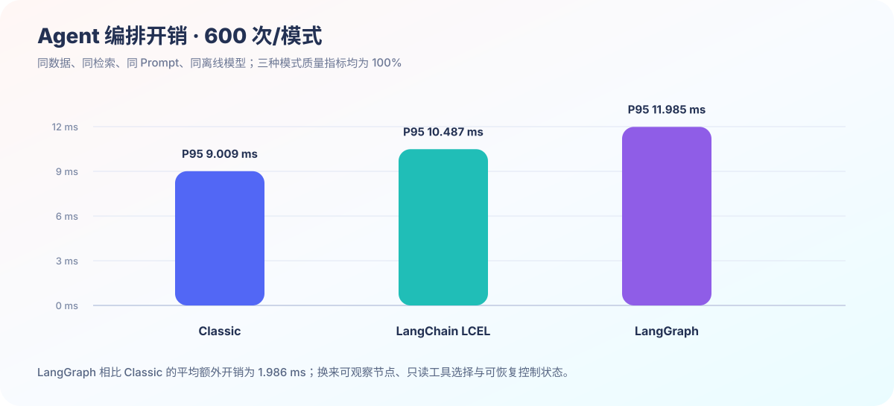
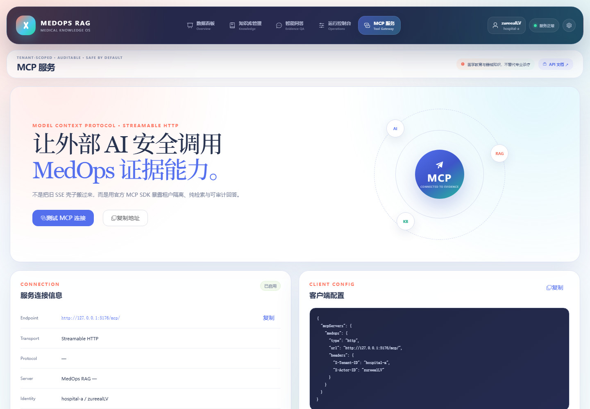
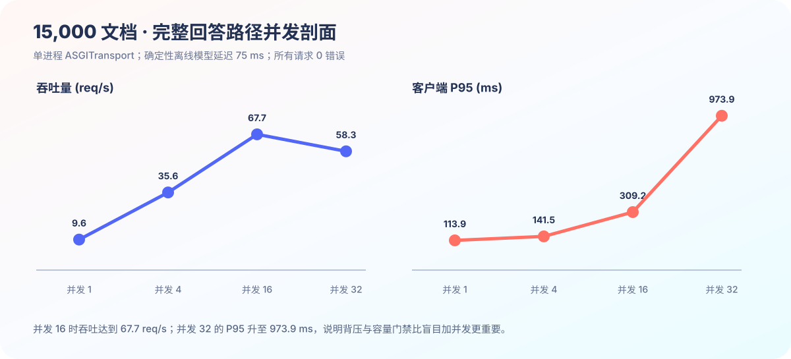

很多 RAG Demo 的终点，是让模型对着几份 PDF 回答出一句看起来正确的话。页面上有一个输入框，后台做一次向量检索，再把 Top K 文本拼进 Prompt——五分钟的视频足够漂亮，真正麻烦的问题却一个都没有消失：这句话来自哪一页？用户能不能看到另一个租户的资料？扫描件和 Office 表格怎么处理？检索不到时系统会不会硬编？模型接口变慢、限流或断开以后，请求又会发生什么？

**MedOps RAG V3.5** 想做的不是另一个“上传文件即可聊天”的壳，而是一条能够解释、复核、拒答和恢复的企业知识问答链路。项目最初用医疗健康与医疗器械公开资料验证高风险场景中的来源追溯和拒答策略，后来演进为面向公开资料与企业内部知识的多租户 RAG Agent。医疗语料仍然保留，但它是第一块严苛的验证场，不是给产品贴标签的装饰纸。

> **项目仓库：** [zureealLV/medops-rag](https://github.com/zureealLV/medops-rag)
>
> 当前版本：**3.5.0**。这是教学与工程作品集，不处理真实患者资料，不构成医疗建议、临床决策支持或合规认证。



## 先别急着接模型：答案必须先回到证据

我给这个项目定下的第一条规则很朴素：**一个答案如果不能回到原始资料，就不能因为语言通顺而被当成可靠答案。**

MedOps 把摄取与问答拆成两条路径。文档进入系统后，要经过格式校验、安全预检、文本与版面解析、OCR、语义分块、索引和证据存储；问题进入系统后，则经过身份与租户边界、查询路由、候选召回、重排、证据门控，再决定交给离线抽取器或外部模型。最终答案中的 `[来源1]`、`[来源2]` 会对应人能读懂的来源卡片，而不是把数据库里的 `document_id:chunk_id` 或一串相似度分数甩给用户。



这条链路有三个“不能偷懒”的地方：

1. **租户过滤必须发生在检索之前。** 不能先把所有人的资料搜出来，再指望模型“自觉”忽略越权内容。
2. **证据阈值必须允许系统失败。** Top 1 只是“最不差的结果”，不等于它真的回答了问题；证据不足时应该明确 abstain。
3. **引用还要二次复核。** 即使 Agent 生成了来源，也必须确认这些来源仍属于当前租户、当前知识库和当前回答范围。

于是，MedOps 的理想输出不是“模型说得很像真的”，而是下面这条可以被逐段检查的路径：

```text
身份与 RBAC
  → 租户范围内检索
  → BM25 / RRF / Parent–Child 路由
  → 证据阈值与注入检测
  → 受控 Agent / 可选 Provider
  → 引用范围复核
  → [来源N] + 来源卡片 + 请求轨迹
```

## 文档摄取：11 种格式不等于 11 个文件后缀

当前系统支持 TXT、Markdown、PDF、DOCX、PPTX、PNG、JPEG、WebP、CSV、JSON 和 JSONL。真正的工作并不是在上传框里多写几个 `accept`，而是让每种格式进入统一的证据模型，并保留它原本的位置关系。

PDF 需要记录页码；PPTX 需要保留幻灯片与形状坐标；Office 表格不能只被拍扁成一段失去行列关系的文本；扫描 PDF 和图片需要走 RapidOCR / ONNX Runtime；原始图片还要按租户计算 SHA-256，在 BLOB 层去重，并通过 ETag 返回。这样，检索命中的不只是“某段文字”，而是带页码、标题、URL、哈希、坐标和解析器版本的证据对象。


文件解析也是攻击面。压缩格式的 Office 文档在真正交给 `python-docx` 或 `python-pptx` 前，会检查条目数量、解压膨胀量、压缩比、危险路径与宏；PDF 有页数与渲染预算；图片有尺寸和载荷上限。摄取任务不是一个“上传后阻塞到结束”的接口，而是带幂等键、租约、有限重试、取消和崩溃恢复的持久任务。Worker 中途退出后，过期租约可以被重新领取，又不会把已经完成的文档重复写入。

这些限制不够性感，却比“支持 PDF 问答”六个字更接近真实工程。毕竟，ZIP 炸弹可不会因为你的按钮用了渐变色就突然讲礼貌。

## 检索不是固定配方：词法、融合与上下文恢复

MedOps 没有把“向量数据库”当作 RAG 的同义词。默认路径以 SQLite FTS5 trigram 为候选召回基础，叠加 BM25、RRF、可选 FastEmbed 向量与 Parent–Child 上下文恢复。查询路由会根据标识符、词面重叠、概念数量和跨章节意图选择策略，并把选择理由与置信度写入轨迹。

为什么还保留 BM25？因为错误码、设备型号、制度编号和产品代号经常依赖精确词面；为什么要 RRF？因为自然语言改写可能让词法结果丢失语义近邻；为什么要 Parent–Child？因为命中点和真正需要返回的操作步骤，经常隔着一个固定分块边界。

在一个 50 问的 Parent–Child 固定测试中，两种策略 Hit@1 都是 `1.0`，但“关联操作是否进入返回上下文”从固定分块的 `0/50` 提升到了 `50/50`。代价也很诚实：平均查询耗时从 `13.628 ms` 增加到 `19.702 ms`。这说明 Parent–Child 解决的是**上下文完整性**，不是凭空提高文档命中率，更不应该被包装成无成本升级。



更有意思的是独立中文挑战集。它包含 28 篇文档和 36 个用例，故意加入错字、低词面重叠、三来源组合与冲突。Adaptive 在 20 个单来源题上达到 Hit@1 `0.80`、Hit@5 `1.00`；但在 8 个多来源题上，Recall@5 为 `0.8333`、完整覆盖@5 为 `0.6250`，反而低于固定 BM25 的 `0.8750 / 0.7500`。

这不是应该藏掉的失败，而是路由器下一步该优化的证据：**自适应策略会选择，不代表每次都选得更好。** 如果一张评测图永远只有满分，大概率不是系统已经完美，而是题目对系统太客气了。

## LangGraph Agent：能调用工具，但不能自由发挥

MedOps 在同一个 `/answer` 接口里保留 Classic Python、LangChain LCEL 和 LangGraph 三种编排模式。它们使用同一套语料、问题集、检索器、Prompt 与模型，以便比较“控制结构”本身的价值，而不是偷偷换数据再宣布某个框架胜出。

LangGraph 路径中的 Agent 最多选择两个由代码所有、只读的白名单工具：一个负责证据回答，一个负责引用租户复核。工具名、参数和调用次数都有限制，非法工具与非法参数直接拒绝；Checkpoint 只保存恢复所需的控制元数据，不把检索正文和密钥塞进状态。



在冻结的 30-case 数据集上，每种模式重复 20 次，也就是各 600 次离线运行。三种模式的 Hit@5、引用正确率和正确拒答率都是 `1.0000`，输出与 Classic 保持一致；LangChain 平均增加 `0.901 ms`，LangGraph 平均增加 `1.986 ms`。

这组数据不能证明“LangGraph 比一切都快”，恰恰相反，它说明显式状态机需要付出一点调度成本。选择它的理由，是节点轨迹、受控工具、Checkpoint 和可恢复流程，而不是在极小离线样本里抢一毫秒的冠军。

## 多轮对话：先解决“它”到底指什么

V3.5 新增了按 `tenant + actor` 持久化的对话与消息。多轮问答最容易被低估的问题不是聊天记录怎么画，而是追问如何在不污染租户边界、不无限膨胀上下文的前提下被重新表述。

例如用户先问“血脂高的话，炒菜油一天多少”，接着只说“那最多到底几克来着？”，第三轮再问“这个是哪个官方材料说的？”系统需要把省略的主题恢复成当前问题，同时继续走原有检索、证据门控和引用复核，不能因为有历史消息就绕过安全策略。

当前仓库保存了一次真实 `deepseek-v4-flash` 多轮评测：16 组对话、48 个回合，覆盖口语化指代、来源追问和安全拒答；报告记录 48/48 通过、36 个真实 Provider 回合，同时保留每轮延迟、Token、重写问题和引用。它证明的是这组冻结用例中的兼容性，不是对所有口语、所有模型和所有企业语料的泛化保证。

## Provider 配置：可见、可测，但密钥不属于浏览器

管理员控制台提供 DeepSeek、OpenAI、通义千问、智谱、Ollama 和自定义 OpenAI-compatible 预设，可以测试连接、切换当前进程配置并复制 `.env` 模板。普通 viewer/editor 看不到这些控制项；API Key 不回显、不写入浏览器持久化，也不进入审计详情。


自定义 Base URL 也不是随便填。开发与测试环境只允许回环地址使用明文 HTTP；私有地址、链路本地地址、URL 凭据、查询字符串、片段以及直接包含 `/chat/completions` 的错误 Base URL 都会被拒绝。运行时切换只在当前进程有效，服务重启后恢复 `.env`，避免一个网页表单悄悄变成长期密钥仓库。

Provider 调用层使用 lifespan 共享的 `httpx.AsyncClient`，并实现全局/租户容量、轮转公平、总 deadline、有限重试、指数抖动、`Retry-After` 上限和熔断。并发 32 时“请求更多”不再被假装成系统更强：队列满、等待超时、模型截止时间和熔断打开都有明确状态码与原因。

## MCP：让外部 AI 复用同一条安全边界

项目通过 MCP Python SDK 2.2 和 Streamable HTTP 在 `/mcp/` 暴露知识库列表、证据检索与受控回答。这里最重要的不是“Codex 也能连上”，而是 MCP 没有另起一条绕过应用安全的捷径：API Key 身份、租户解析、审计、策略拒答和引用复核都与 HTTP 问答复用同一套服务逻辑。



换句话说，Web 控制台、脚本客户端和外部 AI Agent 看到的是不同入口，但它们不能拥有三套互相矛盾的权限边界。否则你在网页里做了半年 RBAC，最后被一个“方便集成”的工具接口从侧门全部绕开，那就不是 Agent 平台，是权限漏洞展览馆。

## 吞吐、延迟和系统开始吃不消的地方

性能数据只有把环境与失败点一起写出来才有意义。MedOps 的离线并发基准运行在 Windows、单应用进程、临时 SQLite WAL 和 `httpx.ASGITransport` 上，使用可控的 75 ms 离线模型替身，没有网络模型调用。

在 15,000 文档和 2,304 次完整回答请求中没有记录到错误；并发 16 时吞吐达到 `67.655 req/s`，但 P95 已升到 `309.240 ms`。并发 32 时吞吐开始回落，P95 恶化到 `973.943 ms`。所以最终设计没有把“16 并发峰值”单独截出来庆功，而是把背压、容量预算、截止时间和熔断器一起做进运行时。



向量存储也遵循同样的原则。Qdrant Server 1.19.0 在 10,000 向量、并发 8 的测试中达到 `77.959 query/s`、Recall@10 `1.0`，跨租户错误命中为 `0`。这证明它是可验证的扩展选项，却不足以证明整套系统已经具备多实例高可用。因此默认发布配置仍选择更容易复现与审计的 SQLite 精确检索，而不是为了技术栈列表更长就强行引入分布式组件。

## 这套系统真正使用了什么

| 层 | 技术 | 负责的事情 |
|---|---|---|
| Web 控制台 | Vue 3.5、TypeScript 5.9、Vite 7、Pinia、Element Plus | 知识库、对话、任务、指标、MCP 与 Provider 管理 |
| API | Python 3.11+、FastAPI、Pydantic、httpx | 类型化接口、依赖注入、异步 Provider 与 OpenAPI |
| Agent | LangChain 1.4、LangGraph 1.2 | LCEL、受控节点、工具轨迹与 Checkpoint |
| 检索 | SQLite FTS5、BM25、RRF、FastEmbed、可选 Qdrant | 词法、稠密、融合与租户过滤 |
| 文档 | PyMuPDF、python-docx、python-pptx、RapidOCR | 文本、表格、OCR、图片与版面证据 |
| 任务与存储 | SQLite WAL、租约队列、SHA-256 | 元数据、审计、异步任务、对话与证据去重 |
| 协议与交付 | MCP 2.2、Docker Compose、Pytest、Ruff | 外部工具接入、服务编排与发布门禁 |

仓库当前检出可收集 **220 项**测试，覆盖 API、安全、解析器、数据库迁移、队列恢复、并发竞态、UI、MCP、Provider 与多轮对话。数量不是质量本身，但每项能力至少需要一个能失败的验证点，而不是在 README 里多一个对勾。

## 本地运行

Windows 10 / PowerShell 下可以按下面的最小路径启动：

```powershell
git clone https://github.com/zureealLV/medops-rag.git
cd medops-rag
python -m venv .venv
.\.venv\Scripts\python.exe -m pip install -e ".[dev]"
.\scripts\build_frontend.ps1
.\.venv\Scripts\python.exe .\scripts\seed_sample_data.py `
  --profile operations --tenant company-a
.\.venv\Scripts\fastapi.exe dev
```

启动后可以访问：

- Web 控制台：`http://127.0.0.1:8000/`
- Swagger：`http://127.0.0.1:8000/docs`
- MCP Streamable HTTP：`http://127.0.0.1:8000/mcp/`
- 健康检查：`http://127.0.0.1:8000/health`

默认使用离线抽取式回答，不配置外部模型也能检查摄取、检索、引用和拒答路径。要连接 OpenAI-compatible Provider，再从 `.env.example` 创建本机 `.env`，填写 `MODEL_API_KEY`、`MODEL_BASE_URL` 和 `MODEL_NAME`；不要把 `.env` 提交进 Git。

## 我刻意没有声称什么

MedOps 仍然是一套单机作品集与教学部署。它没有证明企业级多实例容量、高可用、灾备或任何行业合规；医疗公开资料不等于专家签核；Prompt Injection 检测是纵深防御，不是“百分之百安全”；CLIP-B/32 在 20 张无文字图标上的英文 Hit@1 为 `0.95`，中文却只有 `0.10`，因此中文视觉向量默认关闭；Docker Linux 镜像也仍应在可用的 Docker Engine 主机上重新做冷启动验证。

这些“不够完美”的句子并不会削弱项目。相反，它们把“已经实现”“已经测量”和“仍待验证”分开，让下一次迭代有清晰起点。

RAG 最危险的幻觉，未必来自模型。有时它来自开发者自己：把一个能演示的流程写成能生产，把一次满分小测写成普遍可靠，把“接入向量库”写成“解决知识问题”。MedOps 想练习的是另一种工程习惯——让每个漂亮结论都带着数据、版本、来源和边界，让系统在不知道的时候敢于说不知道，让任何入口都不能绕过同一条证据链。

这大概没有“一键知识库”那么轻巧。但企业资料本来就不该被一键糊弄过去。
