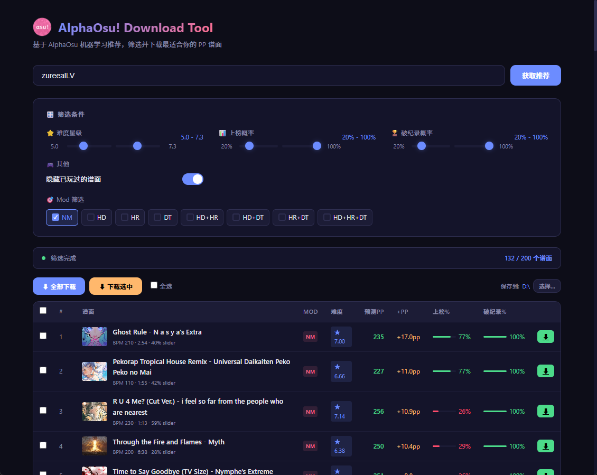

> **GitHub** → [AlphaOsu-Download-Tool](https://github.com/zureealLV/AlphaOsu-Download-Tool)

## 这是什么

[AlphaOsu](https://alphaosu.keytoix.vip/) 是一个用机器学习帮你刷 PP 的网站——它会分析你的游玩数据，推荐你最有可能拿到 PP 的谱面。

但它没有批量下载功能。每次想下谱子，得一个一个点开 osu! 官网再下载，非常痛苦。

所以我就逆向了它的 API，做了一个基于 PyWebView 的桌面 GUI 工具——有界面、有封面图、支持筛选和批量下载，还能自定义保存目录。




---

## 逆向 API

AlphaOsu 是一个 React SPA，接口藏在编译后的 JS bundle 里。

### 找到接口

直接看打包后的 JS 文件，grep 关键词：

```bash
curl -s "https://alphaosu.keytoix.vip/assets/index.c1b1fee7.js" | grep -oP '"/api/v1/[^"]*"'
```

几个关键接口：

| 接口 | 用途 |
|------|------|
| `POST /api/v1/login` | 登录（只需 osu! 用户名） |
| `GET /api/v1/self/maps/recommend` | 获取 PP 推荐谱面 |

### 登录

登录非常简单，POST 一个用户名就行，不需要密码：

```python
def login(username):
    """登录获取 uid —— AlphaOsu 用 osu! 用户名作为唯一标识"""
    result = api_post("/login", {"username": username})
    # 返回示例: {"uid": "37641269", "keyCount": 4, "gameMode": 0, "mod": ["NM"]}
    return result["data"]["uid"]
```

### 获取推荐（分页）

API 用 `current` + `pageSize` 分页，`next` 字段指向下一页页码，`-1` 表示没有了。

```python
def get_all_recommendations(uid, game_mode=0):
    """自动翻页获取全部推荐谱面
    
    API 每次返回 20 个，用 current 参数翻页。
    返回的 next 字段是下一页页码，-1 表示没有了。
    """
    all_maps = []
    current = 1
    
    while True:
        result = api_get("/self/maps/recommend", {
            "uid": uid,
            "gameMode": game_mode,   # 0=osu!standard
            "current": current,       # 页码（不是 offset！）
            "pageSize": 20,           # 每页数量
            "rule": 4,                # 推荐算法版本（JS里是 Sa.V4 = 4）
        })
        
        data = result["data"]
        all_maps.extend(data["list"])
        
        # next=-1 表示没有下一页了
        if data["next"] == -1:
            break
        current = data["next"]
        
    return all_maps
```

### 推荐数据结构

每个谱面的数据长这样：

```json
{
  "id": "933875/0/0",
  "mapName": "Ghost Rule - N a s y a's Extra",
  "mapLink": "https://osu.ppy.sh/beatmaps/933875",
  "mapCoverUrl": "https://assets.ppy.sh/beatmaps/413117/covers/cover.jpg",
  "mod": ["NM"],
  "difficulty": 7.0,
  "predictPP": 235.49,        // 预测能拿到的 PP
  "ppIncrementExpect": 16.95,  // 期望 PP 提升
  "passPercent": 0.765,        // 上榜概率（0-1）
  "newRecordPercent": 1.0,     // 破纪录概率（0-1）
  "bpm": 210,
  "length": 174,
  "sliderRatio": 0.395
}
```

注意 `passPercent` 和 `newRecordPercent` 是 0-1 的小数，界面上显示的百分比要乘以 100。

---

## 桌面 GUI 工具

基于 [PyWebView](https://pywebview.flowrl.com/) 构建，前端用 HTML/CSS/JS 渲染，Python 负责后端逻辑和文件下载。不需要浏览器，直接弹出一个原生窗口。

> **GitHub** → [zureealLV/AlphaOsu-Download-Tool](https://github.com/zureealLV/AlphaOsu-Download-Tool)

### 功能特性

- **谱面卡片**：每首歌显示封面图、曲名、星数、Mod、预测 PP、上榜概率等
- **多条件筛选**：星数范围、Mod 类型、上榜概率、破纪录概率、隐藏已玩过的
- **批量下载**：勾选想要的谱面，一键批量下载 .osz 文件
- **自定义目录**：可以指定保存路径，直接下到 osu! 的 Songs 文件夹
- **下载源**：使用 Sayobot 国内镜像，免登录、速度快

### 技术架构

```
┌──────────────────────────────┐
│         PyWebView 窗口        │
│  ┌─────────────────────────┐ │
│  │   HTML/CSS/JS 前端界面   │ │
│  │   (谱面卡片、筛选控件)    │ │
│  └────────┬────────────────┘ │
│           │ pywebview JS API  │
│  ┌────────▼────────────────┐ │
│  │   Python 后端            │ │
│  │   - AlphaOsu API 交互    │ │
│  │   - Sayobot 下载         │ │
│  │   - 文件系统操作          │ │
│  └─────────────────────────┘ │
└──────────────────────────────┘
```

PyWebView 在前端 JS 和 Python 之间搭了一座桥：前端调用 `window.pywebview.api.xxx()` 就能触发 Python 后端的函数，实现了登录、获取推荐、下载等操作，同时避免了浏览器环境下的 CORS 限制。

### 安装与运行

```bash
# 克隆仓库
git clone https://github.com/zureealLV/AlphaOsu-Download-Tool.git
cd AlphaOsu-Download-Tool

# 安装依赖
pip install -r requirements.txt

# 运行
python main.py
```

### 下载源

osu! 官网下载需要登录，但国内镜像 Sayobot 可以免登录直接下载：

```python
# Sayobot 的下载接口，传入 beatmapset ID 即可
SAYOBOT_DL = "https://dl.sayobot.cn/beatmaps/download"

def download_beatmap(set_id, map_name, download_dir):
    """从 Sayobot 镜像下载 .osz 文件
    
    .osz 就是 osu! 的谱面包，双击就能导入游戏。
    """
    url = f"{SAYOBOT_DL}/{set_id}"
    with urllib.request.urlopen(req, timeout=120) as resp:
        data = resp.read()
        # 保存为 "413117 Ghost Rule.osz"
        with open(filepath, "wb") as f:
            f.write(data)
```

### 从封面 URL 提取 beatmapset ID

API 返回的是单个难度的 beatmap ID，但下载需要 beatmapset ID。从封面 URL 里可以提取：

```python
def extract_beatmapset_id(cover_url):
    """从封面 URL 提取 beatmapset ID
    
    输入: https://assets.ppy.sh/beatmaps/413117/covers/cover.jpg
    输出: 413117
    """
    match = re.search(r'/beatmaps/(\d+)/covers/', cover_url)
    return match.group(1) if match else None
```

### 客户端筛选

API 不支持服务端筛选（传什么参数都没用），所以全部在客户端过滤：

```python
def filter_maps(maps, config):
    """多条件筛选
    
    筛选条件：
    - 星数范围（默认 5.0 - 7.3）
    - 隐藏已玩过的（currentPP != None）
    - Mod 类型（默认只要 NM）
    - 上榜概率（默认 20% - 100%）
    - 破纪录概率（默认 20% - 100%）
    """
    filtered = []
    for m in maps:
        # 星数范围
        if m["difficulty"] < config.min_star or m["difficulty"] > config.max_star:
            continue
        # 隐藏已玩过 —— currentPP 不为 null 说明打过了
        if config.hide_played and m.get("currentPP") is not None:
            continue
        # Mod 过滤
        if config.mods:
            map_mods = set(m.get("mod", []))
            if not any(mod in map_mods for mod in config.mods):
                continue
        # 上榜概率 —— API 返回的是 0-1，要乘 100 变成百分比
        if m.get("passPercent") is not None:
            pct = m["passPercent"] * 100
            if pct < config.min_rank or pct > config.max_rank:
                continue
        # 破纪录概率
        if m.get("newRecordPercent") is not None:
            pct = m["newRecordPercent"] * 100
            if pct < config.min_record or pct > config.max_record:
                continue
        filtered.append(m)
    return filtered
```

---

## 相关链接

- [AlphaOsu-Download-Tool (GitHub)](https://github.com/zureealLV/AlphaOsu-Download-Tool) — 工具源码
- [AlphaOsu](https://alphaosu.keytoix.vip/) — ML 推荐引擎
- [Sayobot](https://sayobot.cn/) — 国内 osu! 谱面镜像
- [PyWebView](https://pywebview.flowrl.com/) — 轻量级跨平台桌面 GUI 框架
- [osu! 官网](https://osu.ppy.sh/) — 你懂的
