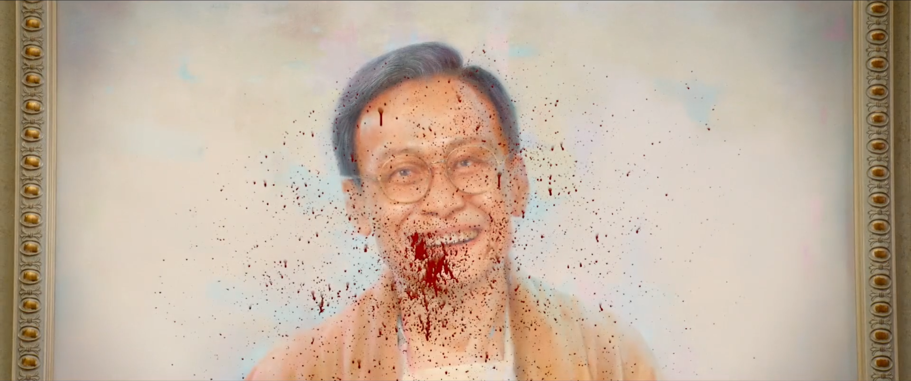

周处除三害的故事可以看作一个精神分析的寓言。他先是除掉了南山猛虎（本我的暴力冲动），然后是北海蛟龙（超我的道德审判），最后才发现——最大的害是自己。

这正是拉康式精神分析的核心：你以为问题在外面，在外面除了一圈害之后，发现那个真正的"害"——那个让你痛苦的根源——其实是你自己分裂的主体性。

所以"除三害"的结局不是消灭，而是觉醒。不是杀掉那个坏自己，而是意识到那个"坏自己"本身就是你的一部分。

